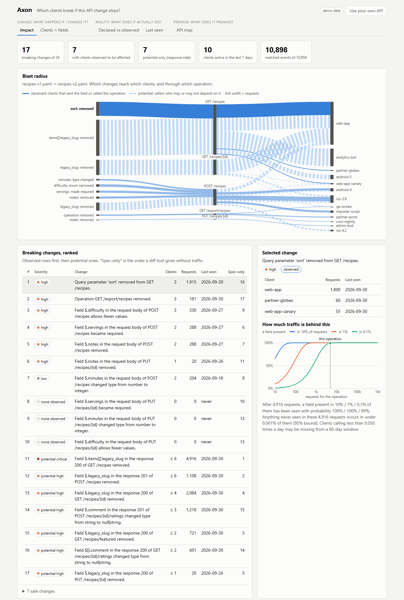
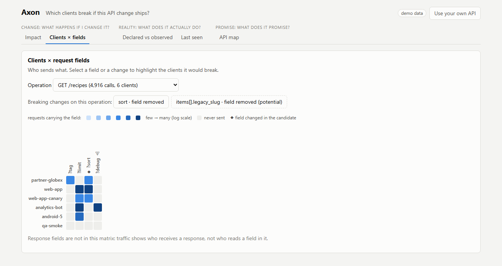
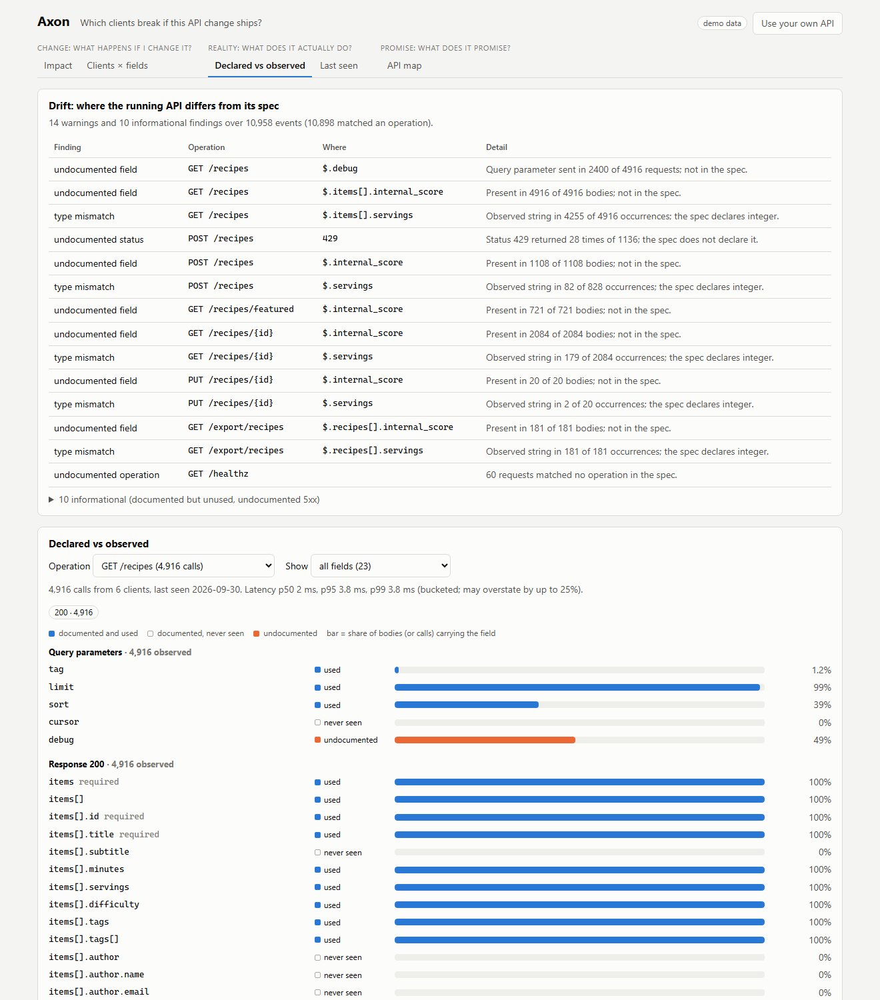
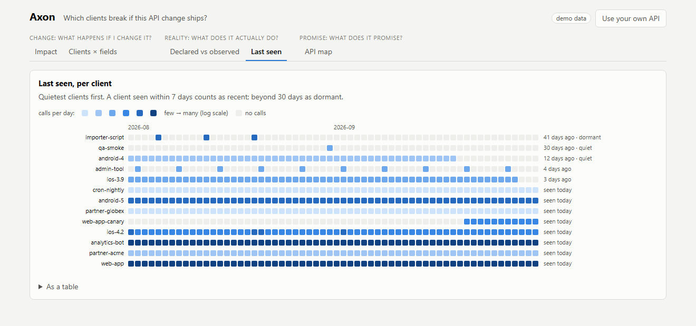
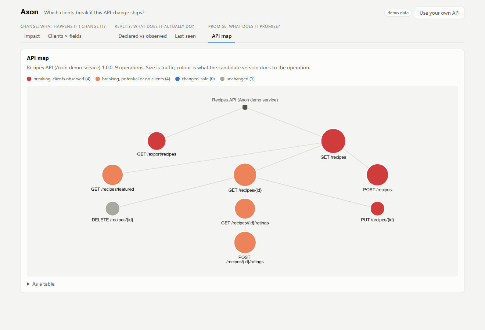

# Axon

**API change-impact analysis.** Diff tools say "removing `phone` is breaking". Axon says *who would break*: it ranks the breaking changes between two OpenAPI versions by the clients that observed traffic shows are affected, and reports where the running API has drifted from its documentation.

> What does my API promise, what does it actually do, and what happens if I change it?



The picture is real HTTP traffic (10,958 requests captured through mitmproxy from a demo service) analysed against a proposed v2 of its spec. The two changes a spec-only ranking puts last, 16th and 17th of 17, are the two with the most certainly-affected clients.

| | Source | What you get |
|---|---|---|
| **Promise** | OpenAPI 3.0/3.1 spec | Explorer, API map |
| **Reality** | Observed traffic (HAR, JSONL, live ingest) | Observed contract, drift, per-client timeline |
| **Change** | Spec v1 → v2 | Diff, **impact analysis**, CI gate |

## The central limitation

Traffic shows who **sends** a request field and who **calls** an operation. It does not show who **reads** a response field. So request-side changes and removed operations are *observed*; response-side changes are only *potentially affected*. Axon never blends the two: different labels, different line styles, separate counts. Measured cost: about three of four clients listed as potentially affected do not read the changed field.

## What has been measured

The method was written before any result existed: [docs/evaluation.md](docs/evaluation.md). Short version, losses included:

| Question | Result |
|---|---|
| Is usage-aware ranking closer to the truth than ranking without traffic? (100 held-out synthetic populations) | Kendall tau with the true affected-client count: **0.69** for Axon, 0.48 ranking by request volume, -0.03 spec-only, 0.00 random |
| How complete is the affected set? | Never names an unaffected client. Sees **69%** of the truly affected in a 7-day window, 85% in 30 days, 51% when client activity is heavy-tailed. Counts are lower bounds |
| Is the diff as good as `oasdiff`? (200 real version pairs: Stripe, GitHub, Twilio, APIs.guru) | **No.** Axon reports 73% of what `oasdiff` calls breaking, 84% of the kinds it models. It does not model `format`, value constraints or `oneOf`/`anyOf` list changes, and has a confirmed blind spot in union schemas |
| How fast does the observed contract converge? | Field recall 0.93 after 100 requests per operation, 0.998 after 100,000, matching the predicted curve |
| How fast is ingestion? (one laptop, one Postgres) | 4,700 events/s in batches of 1,000; 111/s one at a time. Replay of 1 million events in 4 minutes, identical to live |

Three bugs the evaluation itself found, a dev-seed tuning that did not hold up on test seeds, and a first Stripe measurement that was much worse than the final one are all written up there. One experiment (a hand-labelled sample, E1c) is waiting for labels.

## Use it

Needs Java 17 and Maven.

```bash
mvn -q -DskipTests clean package
```

**Rank the breaking changes** (prints the report; `--out report.json` saves it):

```bash
java -jar axon-cli/target/axon-cli-0.1.0-SNAPSHOT-all.jar impact --baseline eval/demo/recipes-v1.yaml --candidate eval/demo/recipes-v2.yaml --usage eval/demo/usage.jsonl --identity-header X-Client-Id
```

**Gate a pull request.** Exit code 1 if an observed breaking change affects at least 10% of the recently active clients:

```bash
java -jar axon-cli/target/axon-cli-0.1.0-SNAPSHOT-all.jar check --baseline eval/demo/recipes-v1.yaml --candidate eval/demo/recipes-v2.yaml --usage eval/demo/usage.jsonl --threshold 10
```

```text
FAIL: 17 breaking changes, 6 over the threshold.
Rule: an observed breaking change affecting at least 10% of the 10 clients active in the last 7 days.
  HIGH       Query parameter 'sort' removed from GET /recipes.
             3 clients (3 recently active, 30% of active), 1915 requests
  ...
7 response-side changes are not gated: traffic shows who calls the operation, not who reads the field. Use --include-potential to gate on callers.
```

Without `--usage`, any breaking change fails the gate. `--fail-on HIGH` gates on severity; `--include-potential` also gates on callers.

**Turn captured traffic into shapes.** Values never reach the output; give the spec so that declared enum values are kept and paths are matched locally:

```bash
java -jar axon-cli/target/axon-cli-0.1.0-SNAPSHOT-all.jar sanitise --har traffic.har --spec v1.yaml --identity-header X-Client-Id --salt my-secret --out usage.jsonl
```

Other commands: `diff`, `explore`, `bundle`. Run the jar with `--help`.

## The web UI

```bash
cd web && npm ci && npm run dev
```

Opens on a precomputed demo, so it works with no backend. Five views:

| | |
|---|---|
|  |  |
| **Clients × fields**: who sends what; select a change to see who it breaks | **Declared vs observed**: documented and used, never seen, undocumented |
|  |  |
| **Last seen**: the rare callers that percentages hide | **API map**: sized by traffic, coloured by what the candidate does |

"Use your own API" switches to a live server. HAR files are reduced to shapes in the browser before upload.

## The server

```bash
docker run -d --name axon-pg -e POSTGRES_USER=axon -e POSTGRES_PASSWORD=axon -e POSTGRES_DB=axon -p 5432:5432 postgres:17
```

```bash
java -Duser.timezone=UTC -jar axon-server/target/axon-server-0.1.0-SNAPSHOT-exec.jar
```

Workspaces with an ingest-only key and an admin key, body, rate and row limits, expiry, and replay. Settings are environment variables; see [docs/architecture.md](docs/architecture.md). A `Dockerfile` is included.

## Repository

| Path | What |
|---|---|
| `axon-core` | Parser, model, diff, matcher, sanitiser, aggregation, drift, impact. No Spring. |
| `axon-cli` | Command line. |
| `axon-server` | HTTP API over Postgres. |
| `axon-eval` | Experiments, traffic simulator, demo service and clients. |
| `web` | React UI. |
| `docs` | [architecture](docs/architecture.md), [metrics](docs/metrics.md), [evaluation](docs/evaluation.md), [report schema](docs/report-schema.md), [decisions](docs/decisions.md), [M1 survey](docs/m1-parse-survey.md), [M3 end to end](docs/m3-end-to-end.md) |
| `eval` | Raw results, dataset manifests, the demo capture, scripts to rebuild everything. |
| `schemas`, `examples`, `tools/schema-check` | JSON schemas for events and reports, validated in CI. |

Tests (the server tests need Docker for Postgres):

```bash
mvn -q verify
```

```bash
cd web && npm test
```

```bash
cd tools/schema-check && npm ci && npm run check
```

## Status

M0-M7 of the plan in [docs/decisions.md](docs/decisions.md) are done, with one open item (E1c labels). Not built: conformance checks against a live endpoint, generated negative tests, lint-style design checks.
